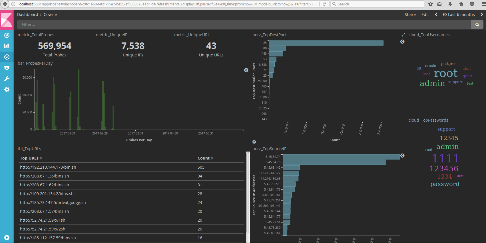

# Introduction
Dlab is a malware [OSINT](https://en.wikipedia.org/wiki/Open-source_intelligence) Toolkit focused on tracking malware. The main goal of this software is to improve the analyst workflow.
This project provide a functionality  for monitoring malicious infrastructure and loaders based on already known [TTPs](https://www.optiv.com/blog/tactics-techniques-and-procedures-ttps-within-cyber-threat-intelligence).
# User Requirements
### Software Interface

#### Libraries:

| Name     | Description   |
|:--------:|:-------------:|
| Elasticsearch  |  Elasticsearch is a distributed, RESTful search and analytics engine capable of solving a growing number of use cases.|
| Cuckoo |    Cuckoo Sandbox is the leading open source automated malware analysis system.  |
|Yara Rules|YARA is a tool aimed at (but not limited to) helping malware researchers to identify and classify malware samples. With YARA you can create descriptions of malware families (or whatever you want to describe) based on textual or binary patterns|

#### Services:

| Name     | Description   |
|:--------:|:-------------:|
| VirusTotal |  VirusTotal aggregates many antivirus products and online scan engines to check for viruses that the user's own antivirus may have missed, or to verify against any false positives. |

  ### User Interfaces
  The user interface will be a dashboard with a visualization of data from analysis.
  
  
  ### User Characteristics
Primary users are malware analysts, reverse engineer. The main requirements for the effective use of this service are the ability to quickly research a new [IoC](https://en.wikipedia.org/wiki/Indicator_of_compromise) and implement them as new rule.
  ### Assumptions and Dependencies
Due to the need for high flexibility, as well as the lack of analogues at the stage of describing requirements, it is difficult to determine the effectiveness and correctness of the expected solutions. In this regard, during the work on the project it is proposed to develop various proofs of the concepts and their testing.
# System Requirements
  ### Functional Requirements
  #### DROPLab
| Function       | Requirements   |
|:--------------:|:--------------:|
| Import configuration        | Import configuration from file  |
|     Check notification   | Check new notification from VirusTotal  |
| Get file |  Get new file with information from VT notification|
| Emulate file |Emulation file from VT in Cuckoo SandBox|
| Report in Elasticsearch|Report results of emulation in Elasticsearch|

  ### Non-Functional Requirements
  ##### SOFTWARE QUALITY ATTRIBUTES
  One of the main requirements is flexibility. The application must be scalable to automate the monitoring of new threats as soon as information is first received. For this, it is supposed to develop an application focused on the fast integration of new modules and rules.
